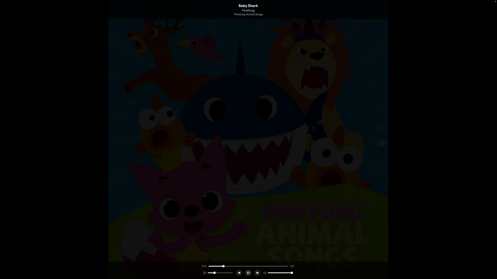

# Spicetify Focus-Mode

Focus-Mode is a Spicetify extension that creates a distraction-free listening experience by hiding everything except the album art.

## How it works
- Adds a focus mode button to the player controls bar
- When activated, hides everything in the Spotify UI except the album art
- Automatically enters fullscreen mode for a completely immersive experience
- Shows player controls and track information on mouse movement
- Controls automatically hide after 3 seconds of inactivity
- Pressing 'L' toggles a lyrics overlay (requires the `lyrics-plus` custom app to be installed)
- Exit focus mode by clicking anywhere (outside controls) or pressing the Escape key

## Features
- Hides everything except album art for a clean, immersive experience
- Automatically enters fullscreen mode when activated
- Shows player controls and track information on mouse movement
- Displays complete track info including title, artist name, and album name
- Includes interactive Volume and Album Art Dimming sliders in the controls overlay
- Optional Lyrics Overlay: Toggles a lyrics display overlay (powered by the external `lyrics-plus` custom app) using the 'L' key.
- Controls automatically hide after 3 seconds of inactivity
- Keyboard shortcuts for playback control and volume adjustment
- Exit focus mode by clicking anywhere (outside controls) or pressing Escape
- Adds a convenient button to the player bar to toggle focus mode

## Keyboard Shortcuts
When Focus Mode is active, the following keyboard shortcuts are available:

| Key | Function |
|-----|----------|
| Space | Play/Pause |
| ← Left Arrow | Previous track |
| → Right Arrow | Next track |
| ↑ Up Arrow | Volume up |
| ↓ Down Arrow | Volume down |
| + | Increase album art brightness |
| - | Decrease album art brightness |
| L | Toggle Lyrics Overlay (requires `lyrics-plus` app) |
| Esc | Exit Focus Mode |

## Screenshots

**Focus-Mode Button:**

**Focus-Mode View:**

*Focus Mode showing dimmed album art.*

**Focus-Mode Controls Overlay:**

*Player controls, volume slider, and dim slider visible on mouse movement.*

##  More
Like it? Star it!    

If you experience any problems, please [create a new issue](https://github.com/BojanRaic/spicetify-extensions/issues/new/choose) on the GitHub repo.    

