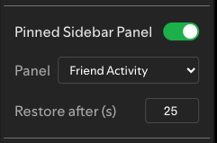

# Pinned Sidebar Panel (PSP)

Spicetify extension to automatically restore a preferred right-hand sidebar panel after a configurable delay.

## Features

*   Ensures your chosen sidebar panel (e.g., "Friend Activity", "Queue", "Now Playing View", "Connect to a device") automatically reappears.
*   Activates after a temporary panel (like "Queue" or "Connect to a device" modal) is closed or if no specific panel is active for a set time.
*   Configurable: 
    *   Enable/Disable the auto-restore feature.
    *   Select your preferred panel from a dropdown.
    *   Set the timeout (in seconds) before the panel is restored.
*   Settings are accessible via a submenu in the profile dropdown menu.
*   User preferences are saved in `localStorage`.

## Usage

1.  Install the extension (e.g., via Spicetify Marketplace or manually) and ensure Spicetify is applied to Spotify.
2.  Click on your profile picture/name in the top-right corner of Spotify.
3.  Find the "Pinned Sidebar Panel" submenu.
4.  Use the toggle to enable or disable the feature.
5.  If enabled, select your desired panel from the "Panel" dropdown.
6.  Adjust the "Restore after (s)" value to set how long the extension waits before restoring your chosen panel.

## Screenshot

## Notes

*   The extension monitors changes in the sidebar and main view to detect when panels are opened or closed.
*   If you manually switch to your preferred panel, the auto-restore timer for that instance is typically cleared.
*   The minimum timeout is 20 seconds to prevent overly aggressive switching.
*   This extension works independently. If using SidebarCustomizer as well, make sure that the settings of the two extensions do not contradict or overlap. 