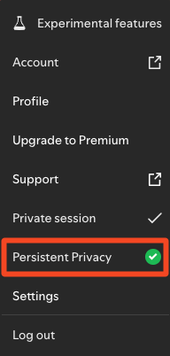

# Spicetify Private Session

Spicetify Private Session is a simple Spicetify extension that will always enable private session. 
Now with a Persistent Privacy mode - re-enables Private Session on window focus, even once Spotify's default 6 hour private session expires. 

## How it works
- On window initialization, try to find the Private Session indicator button to determine if we're already in private mode
- If we're not already listening in private mode, open the main menu, and select the Private Session menu item to activate private session
- New menu item to toggle the Persistent Privacy mode is added to the main menu and the user's preference is stored in local storage, so it persists across application restarts. 
- If the Persistent Privacy mode is enabled, an `onFocus` window listener will ensure to check for Private Session every time Spotify window is focused. 
  - This will maintain a Private Session for durations longer than Spotify's default of 6 hours. 

## Screenshot

*Persistent Privacy menu item with checkmark indicating it's enabled*

##  More
Like it? Star it!    

If you experience any problems, please [create a new issue](https://github.com/BojanRaic/spicetify-extensions/issues/new/choose) on the GitHub repo.    
