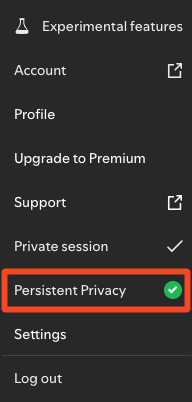

# Spicetify Private Session

Spicetify Private Session is a simple Spicetify extension that will always enable private session. 
Now with a Persistent Privacy mode - re-enables Private Session on window focus, even once Spotify's default 6 hour private session expires. 

## How it works
- On startup, enables Private Session directly via `Spicetify.Platform.PrivateSessionAPI.setPrivateSession()` — no menu interaction needed.
- Adds a "Persistent private session" toggle to the profile menu; your preference is stored in `localStorage` and persists across restarts.
- When Persistent Privacy is enabled, window `focus` and `visibilitychange` listeners re-enable Private Session whenever you return to Spotify — maintaining it beyond Spotify's default 6-hour limit.

## Screenshot

*Persistent Privacy menu item with checkmark indicating it's enabled*

##  More
Like it? Star it!    

If you experience any problems, please [create a new issue](https://github.com/BojanRaic/spicetify-extensions/issues/new/choose) on the GitHub repo.    
