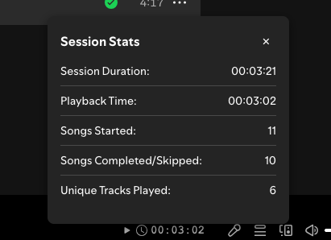

# Spicetify Sesh-Stats

Spicetify Sesh-Stats is a simple extension that tracks listening statistics for your current Spotify session. 

## Features
- Displays playback time in Spotify's bottom bar with simple icons
- Tracks session duration, actual music playback time, and song counts
- Counts songs started and songs completed/skipped
- Keeps track of unique tracks played during your session

## How it works
- Adds a play time counter with icons in Spotify's bottom status bar
- Click the counter to open a detailed overlay with complete session statistics
- All stats are reset when you close Spotify - no data is stored permanently
- Close the overlay by clicking the X, clicking outside, or pressing Escape

## Screenshot

*Sesh-Stats overlay showing listening statistics*

##  More
Like it? Star it!    

If you experience any problems, please [create a new issue](https://github.com/BojanRaic/spicetify-extensions/issues/new/choose) on the GitHub repo.    
 