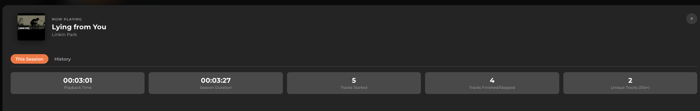
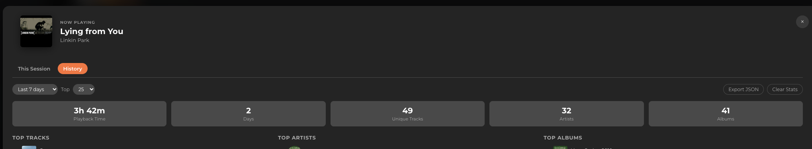

# Spicetify Sesh-Stats

Sesh-Stats tracks your Spotify listening statistics — both live session data and persistent history across days — right inside Spotify.

## Features

### Playbar Icon
- Animated equalizer icon in Spotify's bottom bar while music is playing, paused when stopped
- Hover for "Session Stats" tooltip
- Click to open the stats panel

### Now Playing Hero
- Full-width hero at the top of the panel showing current track art, name, and artist
- Album art background with blur/color effect pulled from the current track
- Click track name, artist, or album art to navigate directly to that page in Spotify

### This Session Tab
- Live playback time and session duration
- Tracks started, finished/skipped, and unique tracks played (counts tracks listened to for 30+ seconds)

### History Tab
- Persistent stats saved to `localStorage` — survives Spotify restarts
- Filter by Last 7 days, Last 30 days, Last 90 days, or All time
- Top Tracks, Top Artists, Top Albums with album art thumbnails
- Configurable top N list size (10 / 25 / 50)
- Click any track, artist, or album to navigate to it in Spotify
- Export full history as JSON
- Clear all history with inline confirmation

## How it works
- A track counts toward history after **30 seconds** of playback (standard scrobble threshold)
- Stats are saved automatically on pause and when Spotify closes
- The panel opens over a frosted-glass backdrop; close with ×, click outside, or Escape

## Screenshots

**This Session**

**History**

## More
Like it? Star it!    

If you experience any problems, please [create a new issue](https://github.com/BojanRaic/spicetify-extensions/issues/new/choose) on the GitHub repo.    

