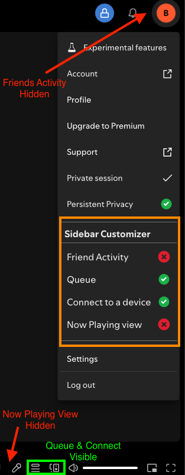

# Sidebar Customizer (SBC)

Spicetify extension to toggle the visibility of right-hand sidebar elements.

## Features

*   Provides a submenu in the profile dropdown to individually toggle visibility of elements that affect the right-hand sidebar:
    -   Friend Activity icon (top bar)
    -   Queue icon (play bar)
    -   Connect to a device (play bar)
    -   Now Playing View (NPV) (play bar)
*   Elements are hidden by default, easily toggled on via main menu
*   User preferences saved in `localStorage`.
*   Attempts to cleanly hide elements, including handling the Now Playing View layout.
*   Dynamically adjusts main view margin when the entire right sidebar is hidden.
*   **Enhanced Alternative:** A more flexible replacement for [Side-Hide](../side-hide/README.md), offering individual control of all sidebar elements rather than an all-or-nothing approach.

## Usage

1.  Install via Marketplace and reload Spotify
2.  Click on your profile picture/name in the top-right corner.
3.  Find the "Sidebar Customizer" submenu.
4.  Click on an item to toggle its visibility (Green Check = Visible, Red X = Hidden).

## Screenshot

*Main Menu showing Sidebar Customizer toggles and the resulting UI tweaks*

## Notes

*   Hiding the Now Playing View can sometimes be tricky due to Spotify's dynamic layout. This extension tries multiple methods (button clicks, CSS) to hide/show it reliably.
*   If the Now Playing View doesn't reappear immediately when toggled on during playback, pausing and resuming playback might help trigger its display.
