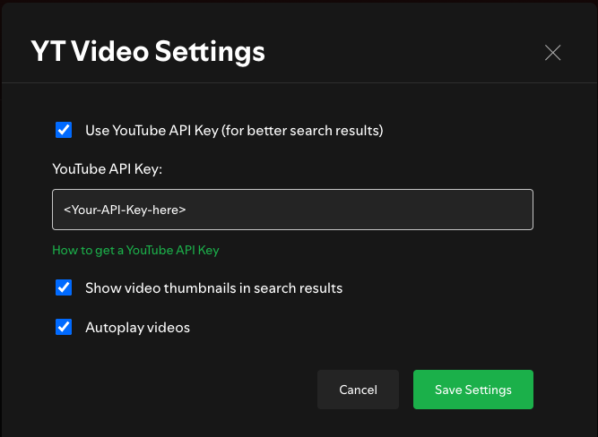
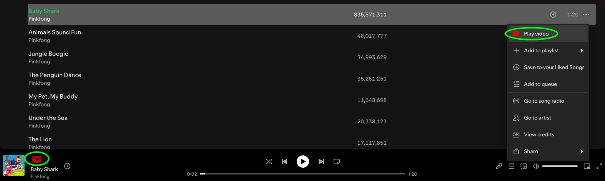

# Spicetify YT-Video

Spicetify YT-Video is a Spicetify extension that adds a YouTube button to the player, allowing you to watch music videos for Spotify tracks without ads, cookies, or tracking.

## How it works

- Adds a YouTube button next to the track info in the Spotify player
- Adds a YouTube item to track's context menu
- When clicked, it opens an overlay within Spotify showing YouTube search results based on the track's artist and name
- You can browse through search results and click any video to watch it in the ad-free player
- Videos play directly in the overlay using the embed player for enhanced privacy
- Navigate through search results with back and forward buttons
- If a video has embedding restrictions, you can open it directly on YouTube

## Important Note

**A YouTube API Key is required for the best experience.** Without an API key, the extension will still work but with limited search functionality.

To set up your API key:
1. [Get a YouTube API key](https://developers.google.com/youtube/v3/getting-started)
2. Click the YouTube button in Spotify
3. Click the "Settings" button in the overlay
4. Enter your API key and enable "Use YouTube API Key"

## Screenshots

1. YT-Video Settings - with API Key

2. YT-Video - ways to invoke the functionality

3. YT-Video - overlay with search result for the selected track

4. YT-Video - overlay playing a chosen video with navigation buttons

## More

Like it? Star it!  

If you experience any problems, please [create a new issue](https://github.com/BojanRaic/spicetify-extensions/issues/new/choose) on the GitHub repo.  
 